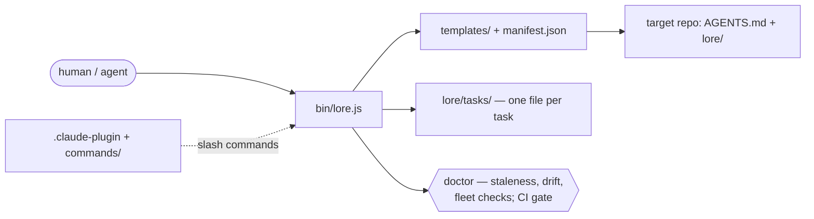

# Architecture

## Overview
A single zero-dependency Node CLI (`bin/lore.js`) renders markdown templates
(`templates/`) into a target repo: `AGENTS.md` at the root (the router) and
knowledge docs under `lore/`. The AGENTS.md read map is generated from each
template's own frontmatter (`read-when`/`update-when`), so the router and
the docs cannot drift apart. Fleet mode adds collection directories
(`lore/tasks/`, `lore/sessions/`) where every item is its own file and git's
push race serves as the claim lock.

## Diagram

## Components

| Component | Responsibility | Lives in |
| --- | --- | --- |
| CLI | Every command: init, doctor, sync, touch, add, task, fleet, playbook, digest, link, ci, list | `bin/lore.js` |
| Templates | 32 doc templates + AGENTS.md, CLAUDE.md, POINTER.md, playbook.md, ci.yml | `templates/` |
| Manifest | Doc key → file path + tier (core/full/guide); everything else comes from template frontmatter | `templates/manifest.json` |
| Claude plugin | `/lore-init`, `/lore-doctor`, `/lore-sync`, `/lore-playbook` | `.claude-plugin/`, `commands/` |
| Tests | 30-check end-to-end smoke suite over temp dirs | `test/smoke.js` |

## Boundaries (do not cross)
Rules that keep the architecture clean. Agents: violating one of these
requires a new entry in lore/decisions.md first.

- `bin/lore.js` stays a single file with zero npm dependencies.
- Read-map data (title, read-when, update-when, summary) lives in template
  frontmatter, never hardcoded in the CLI; `manifest.json` holds only file
  path and tier.
- Fleet coordination uses only the filesystem and git — no network, no
  locks outside git's push semantics.
- Templates never reference each other's content — only AGENTS.md routes.
