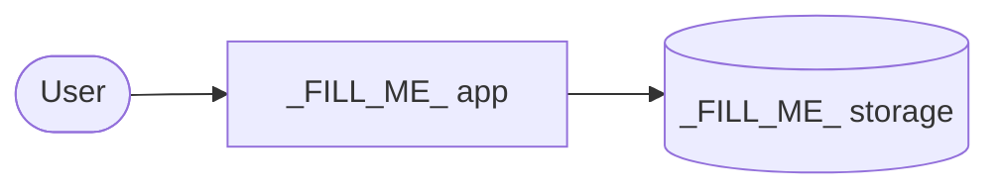

# Architecture

## Overview
_FILL_ME_ (2–4 sentences: the major parts and how data flows between them)

## Diagram

Keep this Mermaid diagram current — it is the first thing agents look at.
Style it with the project's brand colors (see lore/brand.md if installed).

## Components

| Component | Responsibility | Lives in |
| --- | --- | --- |
| _FILL_ME_ | _FILL_ME_ | _FILL_ME_ |

## Boundaries (do not cross)
Rules that keep the architecture clean. Agents: violating one of these
requires a new entry in lore/decisions.md first.

- _FILL_ME_ (e.g. "UI never talks to the database directly")
