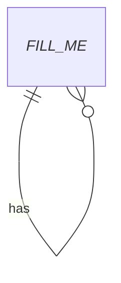

# Data model

## Storage
_FILL_ME_ (database/engine, where migrations live, how to run them)

## Entities

| Entity | Purpose | Key fields |
| --- | --- | --- |
| _FILL_ME_ | _FILL_ME_ | _FILL_ME_ |

## Rules
- Migrations: _FILL_ME_ (e.g. "always additive; never edit an applied migration")
- _FILL_ME_ (soft-delete vs hard-delete, timestamps convention, id scheme)
